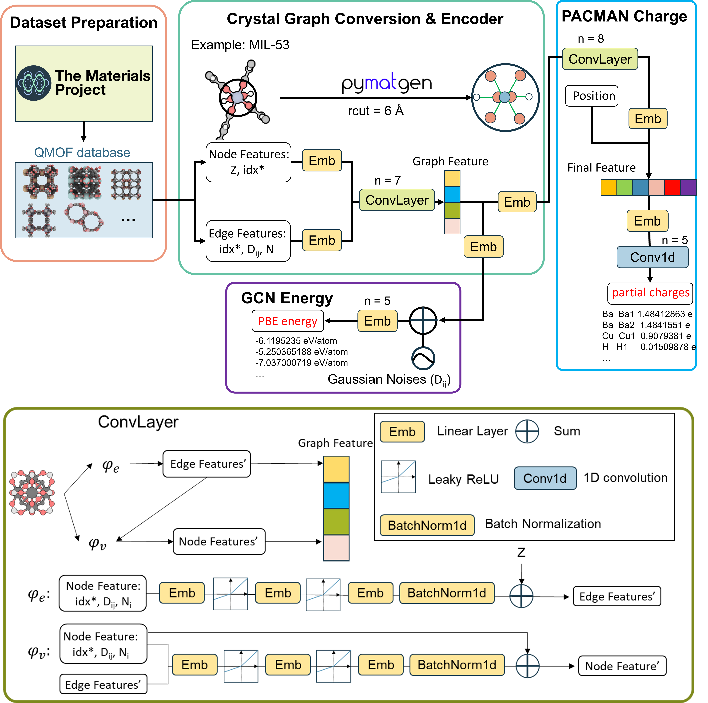

<h1 align="center">PACMAN</h1>

<h4 align="center">

</h4>              

A **P**artial **A**tomic **C**harge Predicter for Porous **Ma**terials based on Graph Convolutional Neural **N**etwork (**PACMAN**)

- DDEC6 ([1](https://doi.org/10.1039/C6RA04656H), [2](https://doi.org/10.1039/C6RA05507A), [3](https://doi.org/10.1039/C7RA07400J), [4](https://doi.org/10.1039/C7RA11829E)), [Bader](https://doi.org/10.1021/jp0482666), [Charge Model 5 (CM5)](https://doi.org/10.1021/ct200866d) for metal-organic frameworks (MOFs)
- DDEC6 for covalent-organic frameworks (COFs)


[](https://python.org/downloads)[](https://pypi.org/project/PACMAN-charge/) [](https://doi.org/10.5281/zenodo.10822403)  [](https://github.com/sxm13/PACMAN/LICENSE.txt) [](mailto:sxmzhaogb@gmail.com) []() []()          
                     

# Installation                             
                                 
:star: **by [pip](https://pypi.org/project/PACMAN-charge/)**                                                              

```sh
pip install PACMAN-charge
```

## by source                                                                  

**Download**                          

```sh
git clone https://github.com/sxm13/PACMAN.git
cd PACMAN
pip install -r requirements.txt
```                            
         
# Charge Assignment               
           
:star: **notebook(from pip)**                      
                
```sh      
from PACMANCharge import pmcharge
pmcharge.predict(cif_file="./test/Cu-BTC.cif",charge_type="DDEC6",digits=10,atom_type=True,neutral=True)

```

cif_file: relative path to a **CIF** file with cif files without partial atomic charges    
                                                                              
                                  
**bash**
```sh
python pmcharge.py folder-name[path] --charge_type[DDEC6/Bader/CM5] --digits[int] [--atom_type] [--neutral]
```
example: ```python pmcharge.py test_file/test-1/ --charge_type DDEC6 --digits 10 --atom_type --neutral```                                                    
usage:  ```python pmcharge.py -h```                                     

* folder-name: relative path to a folder with cif files without partial atomic charges                            
* charge-type (default: DDE6): DDEC6, Bader or CM5
* digits (default: 6): number of decimal places to print for partial atomic charges. ML models were trained on a 6-digit dataset.                                                     
* atom-type (default: False): keep the same partial atomic charge for the same atom types (based on the similarity of partial atomic charges up to 3 & 2 decimal places).                                     
* neutral (default: False): keep the net charge is zero. We use "mean" method to neuralize the system where the excess charges are equally distributed across all atoms.                   

# Website & Zenodo
* Predict partial atomic charges using an online APP :point_right: [link](https://pacman-charge-mtap.streamlit.app/).       
* Full code and dataset can be downloaded from :point_right: [link](https://zenodo.org/records/10822403)
* Note: All future releases will be uploaded on Github and pip only.

# Reference
If you use PACMAN charge, please consider citing [this paper]():
```bib
@article{,
    title={PACMAN: A Robust Partial Atomic Charge Predicter for Nanoporous Materials using Crystal Graph Convolution Network},
    DOI={},
    journal={},
    author={Zhao, Guobin and Chung, Yongchul},
    year={2024},
    pages={}
}
```

# Bugs

 If you encounter any problem during using **PACMAN**, please email ```sxmzhaogb@gmail.com``` or create "issues".

 
# Development

                  
| Database with DDEC Charges                                                                                                                                      | url                                                                                                                                        | size                                                                                                                                                                                                                                                                                                                                                                                              |
| ---------------------------------------------------------------------------------------------------------------------------------------------- | -------------------------------------------------------------------------------------------------------------------------------------------------------- | --------------------------------------------------------------------------------------------------------------------------------------------------------------------------------------------------------------------------------------------------------------------------------------------------------------------------------------------------------------------------------------------------------- |
| QMOF | [link](https://github.com/Andrew-S-Rosen/QMOF) | 16,779 |
| CoRE MOF 2014 DDEC | [link](https://zenodo.org/records/3986573#.XzfKiJMzY8N) | 2,932 |
| CoRE MOF 2014 DFT-optimized | [link](https://zenodo.org/records/3986569#.XzfKcpMzY8N) | 502 | 
| CURATED-COFs | [link](https://github.com/danieleongari/CURATED-COFs) | 612 |

#### Workflow            
             
                    
### Folder contents
```
.
├── ..
├── figs                                                # Figures used for introduction 
│   ├── toc.jpg                                         # Table of Contents
│   └── workflow.png                                    # Workflow of this project
│
├── model                                               # Python files used for dataset prepartion & GCN training
│   ├── GCN_E.py                                        # Networks model for energy/bandgap training
│   ├── GCN_charge.py                                   # Networks model for atomic charge training
│   ├── cif2data.py                                     # Convert QMOF database to dataset
│   ├── data_E.py                                       # Convert cif to graph & target (energy/bandgap)
│   ├── data_charge.py                                  # Convert cif to graph & target (atomic charge)
│   └── utils.py                                        # Normalizer, sampling, AverageMeter, save_checkpoint
│
├── model4pre                                           # Python files used for prediction
│   ├── GCN_E.py                                        # Networks model for energy/bandgap prediction
│   ├── GCN_charge.py                                   # Networks model for atomic charge prediction
│   ├── atom_init.json                                  # a JSON file that stores the initialization vector for each element
│   ├── cif2data.py                                     # Read/write cif file
│   ├── data.py                                         # Convert cif to graph & target (energy/bandgap)
│   ├── data_charge.py                                  # Convert cif to graph & target (atomic charge)
│   └── utils.py                                        # Normalizer, sampling, AverageMeter, save_checkpoint
│
├── pth                                                 # Models of this project
│   ├── best_bader                                      # Bader
│   │   ├── bader  .pth                                 # Bader charge model
│   │   └── normalizer-bader.pkl                        # Normalizer of bandgap
│   ├── best_bandgap                                    # Bandgap
│   │   ├── bandgap.pth                                 # Bandgap model
│   │   └── normalizer-bandgap.pkl                      # Normalizer of bandgap
│   ├── best_cm5                                        # CM5
│   │   ├── bandgap.pth                                 # ///
│   │   └── normalizer-bandgap.pkl                      # ///
│   ├── best_ddec                                       # ///
│   │   ├── ddec.pth                                    # ///
│   │   └── normalizer-ddec.pkl                         # ///
│   ├── best_pbe                                        # ///
│   │   ├── pbe-atom.pth                                # ///
│   │   └── normalizer-pbe.pkl                          # ///
│   ├── chk_bader                                       # Bader
│   │   └── checkpoint.pth                              # Checkpoint of bader
│   ├── chk_bandgap                                     # Bandgap
│   │   └── checkpoint.pth                              # Checkpoint of bandgap
│   ├── chk_cm5                                         # CM5
│   │   └── checkpoint.pth                              # ///
│   ├── chk_ddec                                        # ///
│   │   └── checkpoint.pth                              # ///
│   └── chk_pbe                                         # ///
│       └── checkpoint.pth                              # ///
│
├── pmcharge.py                                         # main python file for atomic charge assignment by command line
├── LICENSE.txt                                         # MIT license
├── README.md                                           # Usage/Source
├── requirements.txt                                    # packages need to be installed
├── train_E.py                                          # main python file for energy/bandgap training
└── train_charge.py                                     # main python file for atomic charge training

```
 
